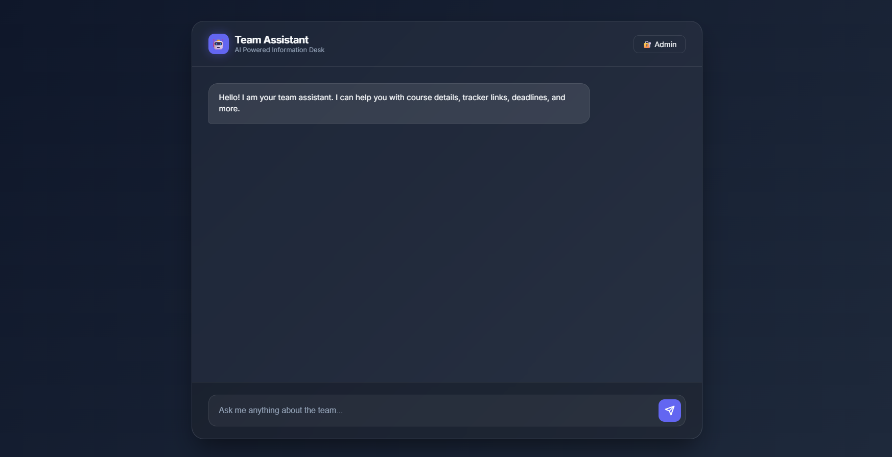

# 🤖 Team Assistant – AI Powered Information Desk  

<p align="center">
  
  
  
  
  
</p>

<p align="center">
  ⚡ A smart chatbot that replaces messy group chats, scattered links, and lost deadlines.
</p>

---

## 📸 Preview  

<p align="center">
  
</p>

---

## 🧠 Overview

**Team Assistant** is a lightweight AI-powered chatbot web application designed to act as a **centralized information hub for teams or students**.

Instead of searching through:
- Messenger groups  
- WhatsApp chats  
- Google Drive links  
- Random documents  

👉 Just ask the chatbot and get instant answers.

---

## 🚀 Core Idea

> “Stop asking in groups. Ask the bot.” 🤖  

This project solves a very real problem:
- ❌ Information scattered everywhere  
- ❌ Repeated questions  
- ❌ Lost deadlines  

✅ One bot → all answers  

---

## ✨ Features

### 💬 Smart Chatbot
- Keyword-based intelligent response system  
- Markdown-supported replies  
- Fast and lightweight logic  
- Clean chat UI  

---

### 📅 Smart Routine System
- Fetches class routines directly from **Google Sheets (CSV)**  
- Advanced date parsing system:
  - `15/02/2026`
  - `15 Jan`
  - `today`  
- Automatically detects and formats results  

---

### 🔐 Admin Dashboard
- Secure login using Firebase Authentication  
- Fully dynamic content management  

#### You can manage:
- 📌 Deadlines  
- 🔗 Trackers & Links  
- 📄 Templates  
- 📊 PPT Files  
- 📚 Courses  
- 🎥 Class formats  
- 📅 Routine sheet link  

✔ Live preview before saving  
✔ One-click save system  

---

## 🔐 Admin Access (Demo)

You can test the admin dashboard using the following credentials:


Email: demo@xyz.com

Password: demo123


👉 Open:

admin.html


⚠️ Note:
- This is a demo account for testing purposes  
- Do not use in production without proper security rules  

---

### ☁️ Firebase Integration
- Firestore database for real-time data  
- Firebase Authentication for admin login  
- Scalable backend without server  

---

### 🎨 Modern UI/UX
- Glassmorphism design  
- Smooth animations  
- Responsive layout  
- Clean chat experience  

---

## 🏗️ Tech Stack

```bash
Frontend   → HTML, CSS, JavaScript  
Backend    → Firebase (Firestore + Authentication)  
Database   → Firestore  
External   → Google Sheets (CSV API)  
````

---

## 📂 Project Structure

```bash
📁 Team-Assistant
│── 🌐 index.html         # Chat interface
│── 🔐 admin.html         # Admin dashboard
│── ⚙️ app.js             # Chatbot logic
│── 🧠 admin.js           # Admin panel logic
│── 🔑 firebase-config.js # Firebase configuration
│── 🎨 style.css          # UI design
│── 📊 knowledge.json     # Sample data
```

---

## ⚙️ Setup Instructions

### 1️⃣ Clone Repository

```bash
git clone https://github.com/akmshamimulislam/Team-Assistant-AI-Powered-Information-Desk
cd team-assistant
```

---

### 2️⃣ Setup Firebase

Go to Firebase Console → Create Project

Enable:

* Authentication (Email/Password)
* Firestore Database

---

### 3️⃣ Configure Firebase

Edit `firebase-config.js`:

```js
const firebaseConfig = {
  apiKey: "YOUR_API_KEY",
  authDomain: "YOUR_AUTH_DOMAIN",
  projectId: "YOUR_PROJECT_ID",
  storageBucket: "YOUR_BUCKET",
  messagingSenderId: "YOUR_SENDER_ID",
  appId: "YOUR_APP_ID"
};
```

---

### 4️⃣ Run Project

Simply open:

```bash
index.html
```

No build tools required 😎
---

## 🧪 Example Queries

Try asking:

* “today routine”
* “class schedule 15 Jan”
* “all deadlines”
* “course info”
* “ppt links”
* “tracker link”

---

## 🎯 Project Info

| Info                 | Details                     |
| -------------------  |---------------------------- |
| 👨‍💻 Developer        | **A. K. M Shamimul Islam**   |
| 📅 Created          | **January 29, 2026**         |
| ⚡ Type             | **Vibe Coding Project**      |
| 🎯 Purpose          | Simplify team communication  |

---

## 🧃 Vibe Coding Philosophy

This project was built using **vibe coding**:

* ⚡ Fast execution over perfection
* 🧠 Build first, optimize later
* 🔥 Focus on real-world usability
* 🚀 Ship quickly

---

## ⭐ Support

If you like this project:

* ⭐ Star the repository
* 🍴 Fork it
* 🚀 Share it with others

---

## 💬 Final Words

> A small tool that solves a big problem.

**Stop asking in groups. Ask the bot. 🤖**
